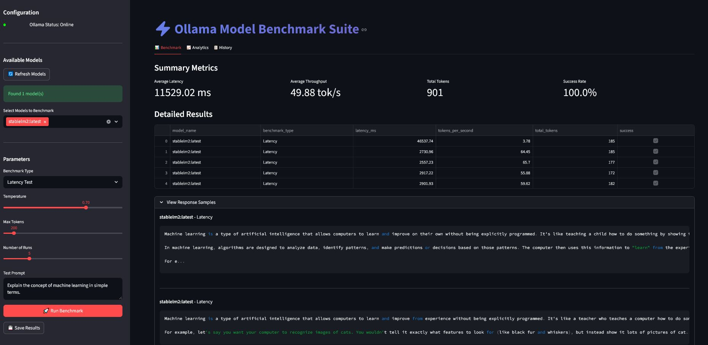

# 🚀 Ollama Model Benchmark Suite

A professional benchmarking suite for evaluating and comparing the performance of AI models served by [Ollama](https://ollama.com/). This Streamlit application provides comprehensive latency, throughput, and quality analysis with beautiful visualizations and historical tracking capabilities.

## ✨ Features

✅ **Multi-Model Benchmarking** - Compare performance across multiple Ollama models simultaneously  
✅ **Comprehensive Metrics** - Measure latency, throughput (tokens/sec), and resource utilization  
✅ **Quality Assessment** - Evaluate models on reasoning, creativity, coding, and factual tasks  
✅ **Real-time Monitoring** - Visual progress tracking with CPU/memory usage monitoring  
✅ **Professional Visualizations** - Interactive Plotly charts for performance analysis  
✅ **Persistent Results** - Save/load benchmark results to/from JSON files  
✅ **Historical Analysis** - Filter and compare results across different time periods  
✅ **Responsive UI** - Professional dashboard with gradient styling and intuitive controls  

## 📸 Tab Overview

The application is organized into three specialized tabs, each serving a distinct purpose in the benchmarking workflow:

### 1. 📊 Benchmark Tab: Real-Time Performance Testing


**Purpose:** The command center for configuring, executing, and monitoring benchmark tests in real-time.

**Key Features:**
- **Status Monitoring**: Color-coded status indicator showing Ollama service availability with real-time connection status
- **Dynamic Progress Tracking**: Animated progress bars with percentage completion during benchmark execution
- **Instant Metrics Dashboard**: Four gradient-styled metric cards displaying:
  - Average Latency (ms)
  - Average Throughput (tokens/second)
  - Total Tokens Processed
  - Success Rate Percentage
- **Detailed Results Table**: Interactive table showing per-run performance metrics with success/failure indicators
- **Response Sampling**: Expandable section to inspect actual model responses and evaluate output quality
- **Model Management**: One-click refresh button to update available models list from Ollama
- **Configuration Flexibility**: Sidebar controls for benchmark type selection and parameter tuning

**User Workflow:**
1. Verify Ollama connection status (green indicator)
2. Select models to benchmark from the available list
3. Choose benchmark type and configure parameters:
   - **Latency Test**: Set number of runs (1-20) and test prompt
   - **Throughput Test**: Configure duration (10-120 seconds) and continuous prompt
   - **Quality Benchmark**: Select from predefined test categories (Reasoning, Creativity, Coding, Factual)
   - **Custom Prompt**: Enter your own specialized prompt for targeted testing
4. Click "🚀 Run Benchmark" button (enabled only when valid configuration exists)
5. Monitor real-time progress and status updates
6. Review immediate results with visual indicators for successful/failed runs

**Unique Value:** Provides immediate feedback loop between configuration, execution, and results visualization without requiring page reloads or external tools.

### 2. 📈 Analytics Tab: Performance Insights & Visualization


**Purpose:** Transform raw benchmark data into actionable insights through professional-grade visualizations and statistical analysis.

**Key Features:**
- **Latency Distribution Analysis**: Interactive box plots showing:
  - Median latency per model
  - Performance spread and consistency (IQR)
  - Outliers and extreme values
  - Individual run points overlaid on distribution
- **Throughput vs. Latency Comparison**: Dual-axis chart combining:
  - Primary axis: Bar chart showing tokens per second (throughput)
  - Secondary axis: Line chart showing average latency in milliseconds
  - Visual correlation between speed and responsiveness
- **Statistical Summary Table**: Comprehensive performance metrics including:
  - Mean and standard deviation for latency
  - Mean and standard deviation for throughput
  - Success rate percentage across all runs
- **Model Performance Ranking**: Automatic sorting and highlighting of top performers
- **Interactive Chart Elements**: 
  - Hover-to-explore detailed metrics
  - Click to toggle specific models on/off
  - Zoom and pan capabilities for detailed examination
  - Export charts as PNG/SVG for reports

**Analytical Capabilities:**
- Identify performance outliers and consistency issues
- Compare trade-offs between latency and throughput
- Evaluate model stability under repeated testing
- Visualize resource utilization impact on performance
- Understand statistical significance of performance differences

**Unique Value:** Moves beyond raw numbers to reveal patterns, correlations, and insights that inform model selection decisions for specific use cases.

### 3. 📋 History Tab: Performance Tracking & Comparative Analysis


**Purpose:** Maintain a comprehensive historical record of benchmark results for longitudinal analysis and performance tracking over time.

**Key Features:**
- **Historical Results Management**:
  - File uploader for loading previous benchmark results
  - File browser for accessing saved JSON result files
  - One-click loading of previously saved benchmarks
- **Time-Based Filtering**:
  - Intuitive calendar-based date range selector
  - Visual timeline showing benchmark density over time
  - Automatic date range detection from loaded data
- **Detailed Results Table**:
  - Timestamped entries showing exact test times
  - Model names and benchmark types clearly labeled
  - Performance metrics with conditional formatting
  - Success/failure indicators with error details on hover
- **Data Export Capabilities**:
  - Filtered results export to CSV format
  - One-click download buttons with proper file naming
  - Export preserves all filtering conditions
- **Comparative Analysis Tools**:
  - Side-by-side comparison of results from different dates
  - Visual indicators highlighting performance changes
  - Ability to load multiple historical datasets simultaneously

**Workflow Integration:**
- Track model performance improvements after Ollama updates
- Compare hardware changes impact on model performance
- Maintain audit trail for production model selection decisions
- Build performance baselines for different model categories
- Identify degradation patterns over time

**Unique Value:** Transforms benchmarking from one-off tests into a continuous performance monitoring system, enabling data-driven decisions about model deployment and hardware investments.

## ⚙️ Installation

### Prerequisites
- [Ollama](https://ollama.com/) installed and running (v0.1.27+)
- Python 3.8 or higher

### Setup Instructions
**Setup python Environment**
# Install dependencies
**pip install -r requirements.txt**
# Run the application
**streamlit run app.py**


## 🧪 Usage Guide

1. **Start Ollama Service**  
   Ensure Ollama is running before launching the application:
   ```bash
   ollama serve
   ```

2. **Launch the Application**  
   Run the Streamlit app:
   ```bash
   streamlit run streamlit_ollama_benchmark_final.py
   ```

3. **Configure Benchmark**  
   In the sidebar:
   - Verify Ollama status indicator (green = online)
   - Select models to benchmark
   - Choose benchmark type:
     - **Latency Test**: Multiple runs measuring response time
     - **Throughput Test**: Fixed duration measuring tokens/second
     - **Quality Benchmark**: Pre-defined tests for reasoning/creativity/coding
     - **Custom Prompt**: Your own test prompt
   - Adjust parameters (temperature, max tokens, etc.)

4. **Run Benchmark**  
   Click the "🚀 Run Benchmark" button and monitor progress in real-time

5. **Analyze Results**  
   - **📊 Benchmark Tab**: View immediate results and response samples
   - **📈 Analytics Tab**: Explore visualizations and performance comparisons
   - **📋 History Tab**: Load historical results and track performance trends

6. **Save Results**  
   Click "💾 Save Results" to export benchmark data to JSON for future analysis